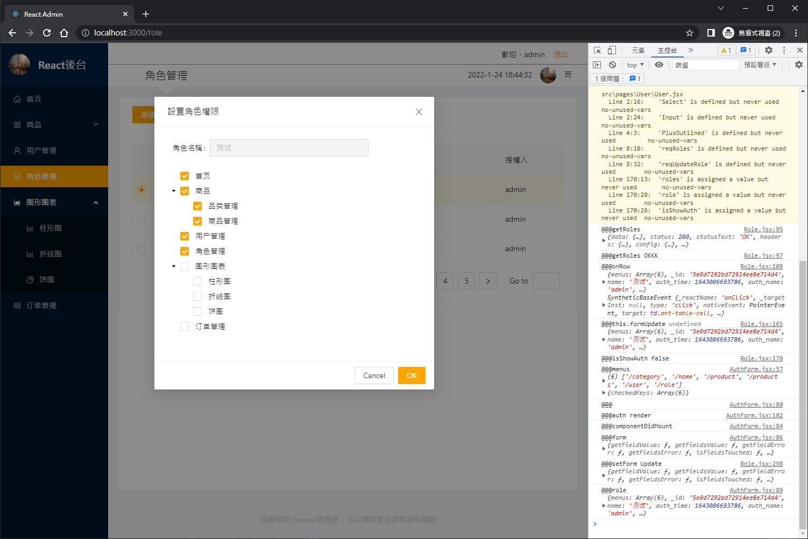

# React 後台管理系統


# 使用技術

- react
- axios
- less
- antd4
- react-draft-wysiwyg
- draftjs-to-html
- jsonp

# 頁面展示

登入頁


首頁


商品->品類管理


商品->品類管理->更新分類


商品->品類管理->查看子分類


商品->品類管理->添加分類


商品->商品管理


商品->商品管理->詳情


商品->商品管理->修改


商品->商品管理->添加商品


商品->用戶管理


角色管理


角色管理->設置角色權限



角色管理->創建角色


# 安裝腳手架

```bash
npm i create-react-app -g
```


# 建立模板項目

```bash
create-react-app react-admin
```


進入項目運行
```bash
cd react-admin
npm start
```


# 打包指令

```bash
npm run build
```


```bash
npm install -g serve
```


```bash
serve build
```


# 整理目錄

刪除項目建構時的檔案


建立新的目錄結構


# Ant Design

https://ant.design/docs/react/use-with-create-react-app-cn


安裝

```bash
npm i antd
```


# 實現組件按需打包

```bash
npm i react-app-rewired customize-cra babel-plugin-import
```


## 創建配置文件(目前無法起作用，可能與版本有關，可先跳過此步驟)

config-overrides.js

```js
const { override, fixBabelImports } = require('customize-cra')

module.exports = override(
  fixBabelImports('import', {
    libraryName: 'antd',
    libraryDirectory: 'es',
    style: 'css',
  })
)
```

## 修改package.json

原配置

```json
  "scripts": {
    "start": "react-scripts start",
    "build": "react-scripts build",
    "test": "react-scripts test",
    "eject": "react-scripts eject"
  },
```

修改後配置

```json
  "scripts": {
    "start": "react-app-rewired start",
    "build": "react-app-rewired build",
    "test": "react-app-rewired test",
    "eject": "react-scripts eject"
  },
```

# 自定義antd主題(可能版本問題會報錯，先跳過此步驟)

安裝依賴

```bash
npm i less less-loader
```


## 修改config-overrides

```js
const { override, fixBabelImports,addLessLoader } = require('customize-cra')

module.exports = override(
  fixBabelImports('import', {
    libraryName: 'antd',
    libraryDirectory: 'es',
    style: true,
  }),
  addLessLoader({
    lessOptions: {
      javascriptEnabled: true,
      modifyVars: { '@primary-color': '#cccccc' },
    },
    sourceMap:true,
  }),
)
```

# 上述按需導入跟改antd無法成功

推測是版本問題

先使用之前完成的項目為基底，繼續先行開發

https://github.com/IvesShe/React_AntDesign

# 安裝路由

```bash
npm install react-router-dom@5.2.0
```

沒指定版本的話，目前這時間安裝(2022/1/5)，會裝到6版的，寫法與舊版的不同，真的蠻多坑的

# 安裝axios

```bash
npm i axios
```

# 封裝axios

/api/ajax.js

```js

import axios from 'axios'

export default function ajax(url, data = {}, type = 'GET') {
  if (type === 'GET') {
    return axios.get(url, {
      params: data
    })
  } else if (type === 'POST') {
    return axios.post(url, data)
  } else {
    console.log("@@@ajax", type)
  }
}
```

/api/index.js

```js
import ajax from './ajax'

// 登入
export const reqLogin = (username, password) => ajax('/login', { username, password }, 'POST')

// 添加用戶
export const reqAddUser = (user) => ajax('/manage/user/add', user, 'POST')
```

# 設置代理伺服

package.json

```json
"proxy": "http://localhost:5000"
```

# stroe

https://github.com/marcuswestin/store.js

安裝store代替localStorage(localStorage有瀏覽器兼容問題)

```js
npm i store
```

# memoryUtils

封裝緩存

memoryUtils.js

```js

export default{
  user: {},
}
```

# storageUtils

封裝localStorage

storageUtils.js

```js
import store from 'store'

const USER_KEY = 'user_key'

export default {
  saveUser(user) {
    //localStorage.setItem(USER_KEY, JSON.stringify(user))
    store.set(USER_KEY, user)
  },

  getUser() {
    //return JSON.parse(localStorage.getItem(USER_KEY) || '{}')
    return store.get(USER_KEY) || {}
  },

  removeUser() {
    //localStorage.removeItem(USER_KEY)
    store.remove(USER_KEY)
  }
}
```

# 新增Login組件

## Login.jsx

```js
import React, { Component } from 'react'
import { Redirect } from 'react-router-dom';
import './Login.less'
import logo from './images/logo.jpg'
import { Form, Input, Button, message } from 'antd';
import { UserOutlined, LockOutlined } from '@ant-design/icons';
import { reqLogin } from '../../api'
import memoryUtils from '../../utils/memoryUtils';
import storageUtils from '../../utils/storageUtils';

export default class Login extends Component {

  render() {
    const user = memoryUtils.user
    if (user && user._id) {
      return <Redirect to='/' />
    }

    const onFinish = async (values) => {
      console.log('Received values of form: ', values)
      const { username, password } = values
      try {
        const res = await reqLogin(username, password)
        console.log("@@@reqLogin res", res.data)
        const result = res.data
        if (result.status === 0) {
          message.success('登入成功')

          const user = result.data
          memoryUtils.user = user
          storageUtils.saveUser = user

          this.props.history.replace('/')
        } else {
          message.error(result.msg)
        }
      } catch (err) {
        console.log("@@@reqLogin err", err.message)
      }
    }
    return (
      <div className='login'>
        <header className='login-header'>
          
          <h1>React項目： 後台管理系統</h1>
        </header>
        <section className='login-content'>
          <h2>用戶登入</h2>
          <div>
            <Form
              name="normal_login"
              className="login-form"
              initialValues={{
                remember: true,
              }}
              onFinish={onFinish}
            >
              <Form.Item
                name="username"
                rules={[
                  {
                    required: true,
                    whitespace: true,
                    message: '用戶名必須輸入!',
                  },
                  {
                    min: 4,
                    message: '用戶名至少4位!',
                  },
                  {
                    max: 12,
                    message: '用戶名最多12位!',
                  },
                  {
                    pattern: /^[a-zA-Z-0-9_]+$/,
                    message: '用戶名必須是英文、數字或下劃線組成!',
                  },

                ]}
              >
                <Input prefix={<UserOutlined className="site-form-item-icon" />} placeholder="用戶名" />
              </Form.Item>
              <Form.Item
                name="password"
                rules={[
                  ({ getFieldValue }) => ({

                    validator(_, value) {
                      console.log("@@@getFieldValue", value)
                      if (!value) {
                        return Promise.reject(new Error('密碼必須輸入!'));
                      } else if (value.length < 4) {
                        return Promise.reject(new Error('密碼長度不能小於4位!'));
                      } else if (value.length > 12) {
                        return Promise.reject(new Error('密碼長度不能大於12位!'));
                      } else if (!/^[a-zA-Z-0-9_]+$/.test(value)) {
                        return Promise.reject(new Error('密碼必須是英文、數字或下劃線組成!'));
                      }
                      return Promise.resolve();
                    },
                  }),
                ]}
              >
                <Input
                  prefix={<LockOutlined className="site-form-item-icon" />}
                  type="password"
                  placeholder="密碼"
                />
              </Form.Item>

              <Form.Item>
                <Button type="primary" htmlType="submit" className="login-form-button">
                  登入
                </Button>
              </Form.Item>
            </Form>
          </div>
        </section>
      </div>
    )
  }
}


```

## Login.less

```less
.login{
  width: 100%;
  height: 100%;
  background-color: darkred;
  .login-header{
    display: flex;
    align-items: center;
    height: 80px;
    background-color: rgba(21,20,13,0.5);
    img{
      display: block;
      width: 40px;
      height: 40px;
      border-radius: 20px;
      margin: 0 15px 0 50px;
    }
    h1{
      font-size: 30px;
      color: #fff;
      line-height: 80px;
      margin: 0px;
    }
  }
  .login-content{ 
    width: 400px;
    height: 300px;
    background-color: #fff;
    margin: 50px auto;
    padding: 20px 40px;
    h2{      
      text-align: center;
      font-size: 30px;
      font-weight: bold;
      margin-bottom: 20px;
    }
    .login-form {
      .login-form-button{
        width: 100%;
      }
    }
  }
}
```

# 安裝jsonp

```bash
npm i jsonp
```

# 安裝富文本

```js
npm install draftjs-to-html
npm install --save react-draft-wysiwyg draft-js
```